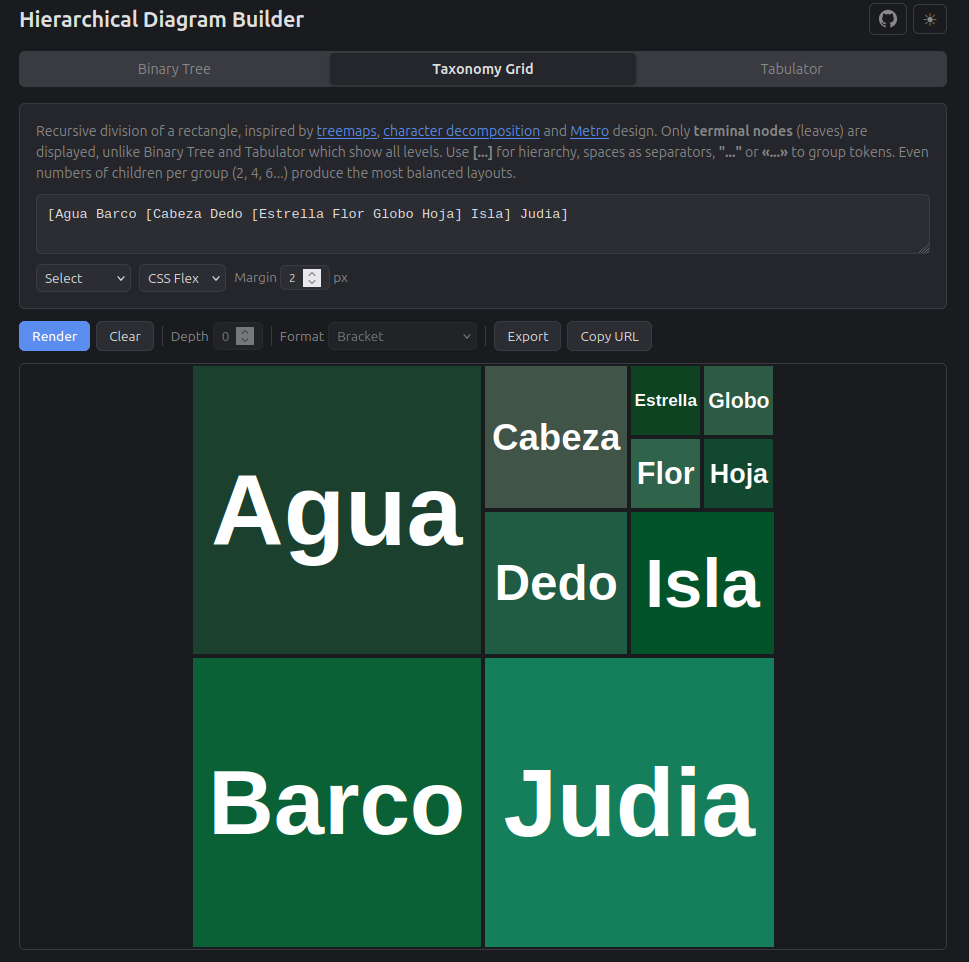

# Hierarchical Diagram Builder



A browser-based tool for visualizing hierarchical data in three different ways:

- **Binary Tree** — SVG diagram of a labeled binary tree (all nodes visible)
- **Taxonomy Grid** — Recursive subdivision of a rectangle (treemap-style, only terminal/leaf nodes displayed)
- **Tabulator** — Hierarchical data rendered as a merged-cell table (all nodes visible)

## Usage

Open `index.html` in a browser. Select a tool, enter your data, and click **Render**.

Includes dark/light theme toggle (dark by default).

### Input formats

Binary Tree and Tabulator share a unified input with three interchangeable formats:

| Format | Example |
|---|---|
| **Bracket** | `[TP [NP [Det the] [N cat]] [VP [V sat]]]` |
| **Bracket (indented)** | Same as above, with line breaks after each `[` |
| **Indented** | One node per line, indentation (tab or 4 spaces) = depth |

Taxonomy Grid uses its own bracket notation where spaces separate siblings and `[...]` creates grouping: `[A B [C D] E]`

> **Note:** Taxonomy Grid produces the most balanced layouts when each group has an even number of children (2, 4, 6...). Odd counts are supported but result in uneven cell proportions.

### Controls

- **Max depth** — Limit rendering depth (0 = unlimited)
- **Format** — Switch between Bracket, Bracket (indented), and Indented (disabled for Taxonomy Grid)
- **Export** — Download as SVG (tree), HTML (grid), or CSV (table)
- **Copy URL** — Shareable link with your data embedded in the URL

### Taxonomy Grid options

- **Cell Action** — Select, Copy text, or Reorder cells visually
- **Method** — CSS Flex or CSS Grid rendering
- **Margin** — Spacing between cells in pixels

## Embedding

There are two ways to embed diagrams in other pages:

### 1. Iframe embedding

Each tool is available as a standalone HTML page. Simple to use, but each iframe loads all scripts independently.

```html
<!-- Binary Tree -->
<iframe src="binarydivision.html?q=[A [B] [C [D] [E]]]&depth=3&theme=dark"
        width="600" height="400"></iframe>

<!-- Taxonomy Grid -->
<iframe src="taxogrid.html?q=[A B [C D]]&method=0&margin=2&action=select&theme=dark"
        width="400" height="400"></iframe>

<!-- Tabulator -->
<iframe src="tabulate.html?q=Animals%0A%09Mammals%0A%09%09Cat%0A%09%09Dog&depth=0&theme=dark"
        width="400" height="300"></iframe>
```

All embeddable pages support a `theme` parameter (`dark` or `light`, default: `light`).

### 2. Direct JavaScript

Load the scripts once and build diagrams directly in the DOM. Much lighter for multiple diagrams on a single page.

```javascript
// Binary Tree
var obj = ParseBrackettedExpr("[A [B] [C [D] [E]]]");
var result = Render(obj);
var svg = result.content.firstChild;
svg.setAttribute('viewBox', '0 0 ' + result.ContainerSize.width + ' ' + result.ContainerSize.height);
svg.removeAttribute('width');
svg.removeAttribute('height');
document.getElementById('container').appendChild(svg);

// Taxonomy Grid
var obj = parserterminal.parse("[A B [C D]]");
var elem = render.TaxoGridCSSFlex(obj, renderoptions.square);
document.getElementById('container').appendChild(elem);
```

See `sample.html` for a working comparison of both approaches side by side.

## Project structure

```
index.html              Main application (unified interface)
sample.html             Embedding examples (iframe vs direct JS)
binarydivision.html     Embeddable binary tree renderer
taxogrid.html           Embeddable taxonomy grid renderer
tabulate.html           Embeddable tabulator renderer
js/
  common.js             Shared utilities
  parsernode.js          PEG.js parser for labeled bracket notation
  parserterminal.js      PEG.js parser for terminal-only bracket notation
  taxogrid.js            Taxogrid rendering (CSS Flex / CSS Grid)
  binarydivision.js      Binary tree SVG rendering
style/
  common.css             Shared CSS utilities
  graphicOutput.css      Main layout and typography
  taxogrid.css           Taxogrid-specific styles
```

## License

[GPLv3](LICENSE)

## Author

Alejandro Rojo Gualix
